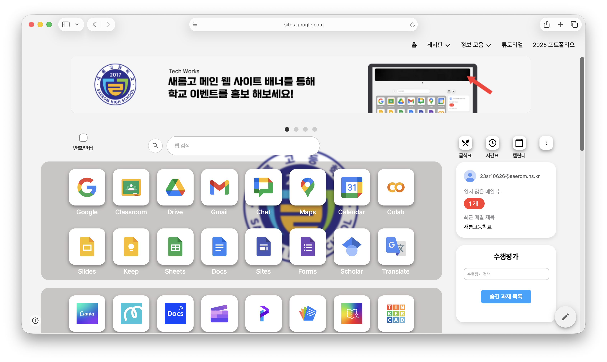
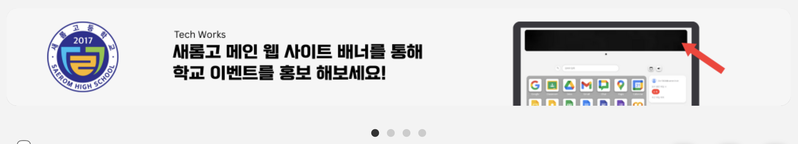
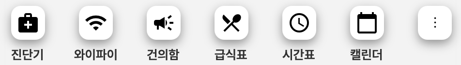
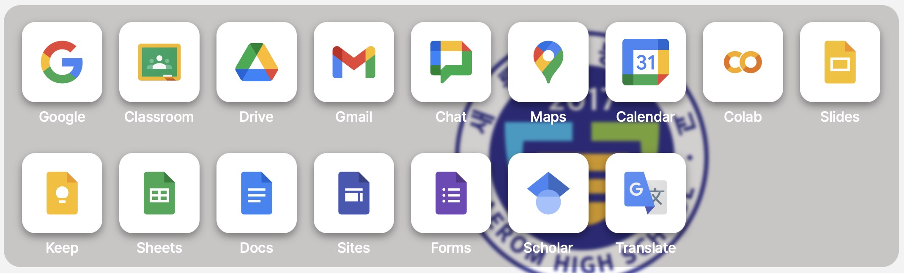
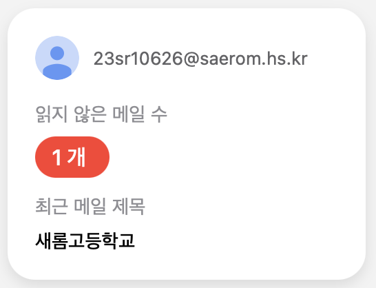
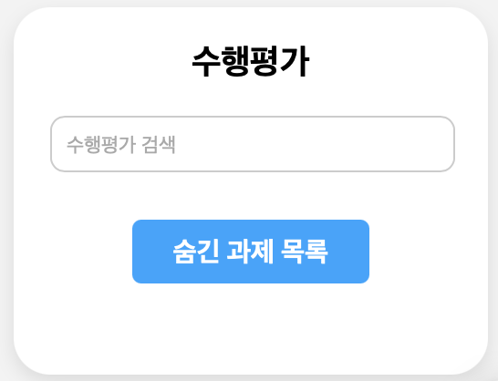

<h2><a href="https://sites.google.com/saerom.hs.kr/main/홈">SAEROM-student.main</a></h2>
<h2>Purpose</h2>

학교에서 사용하는 크롬북을 더 편리하게 사용하기 위해 개발되었습니다.

<h2>Element</h2>

<b>배너</b>

교내 행사, 공지 사항 등을 알릴 수 있는 배너 시스템입니다.

<b>크롬북 관리</b>

학생들이 크롬북 반출시 반출 사유와 시각을 확인할 수 있도록 하는 크롬북 관리 시스템입니다.

<b>검색창</b>

크롬북에서 사용할 수 있는 웹 사이트를 검색하여 접속할 수 있도록 하는 검색 시스템입니다.

<b>부가 기능</b>

<b>웹 런처</b>

<b>gmail 알림</b>

<b>수행평가 알림</b>

